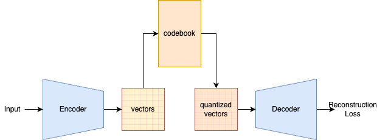
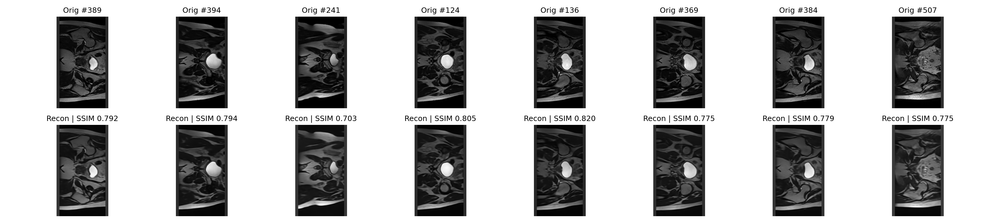

# VQVAE HipMRI Pattern Recognition + Image Generation


## Description
This repository contains an implementation of the Vector Quantized Variational AutoEncoder (VQVAE) for generative modelling and reconstruction of HipMRI slices from the CSIRO HipMRI study. The goal is to learn a discrete latent representation of MRI images that enables:
- High-fidelity reconstruction of MRI slices
- Generation of new plausible MRI samples
- Quantitative assesement using SSIM (Structural Similarity Index). To this, an acceptable result will be over 0.6.
The original paper for VQVAEs can be found at https://arxiv.org/abs/1711.00937.

## VQVAE Description
A VQVAE is a generative machine learning model that aims to improve on variational autoencoders by adding a Vector Quantization layer. A VAE learns to compress images into a continuous latent space where we can generate new data from. Contrarily, VQVAE's learns to compress images into a discrete latent space where each part of an image is represented by a codebook of vectors (this process is called vector quantization). Generally, this makes reconstructions sharper and more detailed than VAE's, because it chooses from specific learned patterns rather than blending everything in an average.


## Implementation
Generally, the architecture of a VQVAE is:



Here, we see a conventional implementation. There are 3 components to take note of: an Encoder, Vector Quantizer (middle) and Decoder. These are explained in detail below.

#### Encoder + Decoder
The Encoder takes an input image x and compresses it into a smaller, latent space through downsampling by convolutional layers and batch normalisation. Essentially maps an input $x -> z$ latent space. After passing image data through many downsampling layers, residual blocks recieve feature maps for refinement. 

The Decoder does the opposite, it takes the quantized latent codes from the vector quantizer and reconstructs the MRI image, allowing the model to learn how to generate realistic hip MRI patterns (takes $z -> x$)

#### Vector Quantizer
Turns encoder's continuous features into discrete codes chosen from a learning codebook (set of embedding vectors). This is a bottleneck with discrete symbols, helping the model learn a compact, reusable vocabulary of patterns (i.e. MRI textures/shapes). Essentially, it:
    - Computes distances from each latent vector to all embedding vectors and picks the nearest using a one hot index.
    - Loss is the codebook loss and it moves codes toward the encoder outputs:
        $β ||z_e – sg(z_q)||² $ from a hyperparameter β.

During training, the embeddings are updated to more accurately represent the feature maps. 

### Residual Layer + Stack
A ResidualLayer is single residual block that refines features without losing the original signal. It learns a small correction and adds it back to the input (x + f(x)), which stabilizes training and helps go deeper. It utilises a ReLU activation layer with a 3x3 and 1x1 convolution layer which helps the model learn detail refinements (i.e. edges and small structures). 

A ResidualStack stacks these multiple ResidualLayer blocks in sequence to increase capacity, which lets the encoder/decoder model increasingly complex patterns without exploding or vanishing gradients. 

#### Contributions
The idea for the VQVAE in project came from MishaLaskin, whose original code can be found here: 
https://github.com/MishaLaskin/vqvae
Additionally, the original paper for VQVAEs can be found at https://arxiv.org/abs/1711.00937.


## Preprocessing
The data was split into training, validation and test sets. Split sizes were predetermined by the sizes of the provided NifTi folders. This was then passed to the loading functions in `dataset.py`. This process is described below:

- Input format: NIfTI (.nii / .nii.gz) slices. Each file is loaded with NiBabel and reduced to a single 2D slice via _ensure_2d (keeps (H,W)).
- Normalization (optional): If normImage=True, each slice is standardized per-image:
$$
x = x−μ/σ+1e−8 
$$ 
(done before padding to keep zeros near mean).
- Sizing to canvas: Every slice is fit to a fixed target_size=(H,W) using `_fit_to_canvas`:
    - `fit_mode="pad_or_crop"` (default): center-crop if too large, symmetric pad if too small. 
    - pad or crop can be forced if desired.
- Tensor shape: Output returned as (N, H, W); the training script then adds a channel → (N, 1, H, W).


## Training
The training script `train.py` performs end-to-end training, validation, and checkpointing of the HipMRI VQ-VAE model. It loads 2D MRI slices (from .nii or .nii.gz files), trains the network to reconstruct them, and automatically saves progress and best models. It includes:
- Automatic resume – continues training from the latest checkpoint (last.ckpt)
- Atomic checkpoint saving – ensures no corruption during interruptions
- Validation with SSIM – measures reconstruction quality using Structural Similarity Index
- Metric logging – saves reconstruction loss, total loss, perplexity, and SSIM in JSON format

The training process is described below:
1. Load data
    Reads NIfTI MRI slices, normalises, and reshapes them into 2D tensors.
2. Initialize model
    Builds the VQ-VAE with configurable hidden channels, residual layers, embedding dimension, and codebook size.
3. Optimizer setup
    Uses Adam with AMSGrad and optional weight decay.
4. Training loop
- Each epoch performs:
    - Forward pass → compute reconstruction and embedding losses
    - Backward pass → optimizer update
    - Logging of reconstruction error, total loss, and codebook perplexity
- After every epoch:
    - Runs validation and computes SSIM
    - Saves checkpoint (ckpt_epoch_XXX.pt)
    - Updates best.ckpt if validation reconstruction improves
- Resumability
    - Automatically resumes training from checkpoints2/last.ckpt if it exists.

Validation Metrics include Reconstruction loss (MSE), Preplexity and SSIM. 

CLI Options:
| Flag                   | Default                                            | Description                                            |
| ---------------------- | -------------------------------------------------- | ------------------------------------------------------ |
| `--batch_size`         | `16`                                               | Number of MRI slices per training batch.               |
| `--epochs`             | `100`                                              | Number of full training epochs.                        |
| `--learning_rate`      | `1e-4`                                             | Adam optimizer learning rate.                          |
| `--weight_decay`       | `1e-5`                                             | Weight decay for regularization.                       |
| `--n_hiddens`          | `512`                                              | Hidden channel width in encoder/decoder.               |
| `--n_residual_hiddens` | `256`                                              | Hidden dimension of residual blocks.                   |
| `--n_residual_layers`  | `16`                                               | Number of stacked residual layers.                     |
| `--embedding_dim`      | `128`                                              | Dimension of latent embeddings (codebook entries).     |
| `--n_embeddings`       | `1024`                                             | Size of the embedding codebook.                        |
| `--beta`               | `0.25`                                             | Commitment loss weight for vector quantization.        |
| `--train_path`         | `../../../keras_slices_data/keras_slices_train`    | Directory of training MRI slices (`.nii` / `.nii.gz`). |
| `--validate_path`      | `../../../keras_slices_data/keras_slices_validate` | Directory of validation MRI slices.                    |
| `--target_size`        | `(256, 144)`                                       | Target 2D slice size (height, width).                  |
| `--fit_mode`           | `"pad_or_crop"`                                    | Resizing strategy for MRI slices.                      |
| `--save_dir`           | `checkpoints2`                                     | Directory where checkpoints and logs are saved.        |
| `--early_stop`         | `False`                                            | Stop early if training stalls (optional).              |
| `--normal_image`       | `True`                                             | Apply image normalisation during preprocessing.        |

Output: 
Checkpoints: All completed training checkpoints (saved to `--save_dir`)
Log: Lightweight JSON summary of the most recent metrics — includes epoch, reconstruction loss, total loss, perplexity, validation loss, and SSIM (saved to `--save_dir`).
Console: metrics (same as log) + epoch number

## Prediction
`predict.py` runs the trained VQ-VAE on test MRI slices, computes SSIM and saves a side-by-side original vs reconstruction panel. It:
- Loads a trained checkpoint (best.ckpt or last.ckpt)
- Loads test NifTi files with same preproccesing used in training (size/normalisation pulled from checkpoint config). 
- Reconstructs a random subset and computes per-image SSIM + mean SSIM. 
- Saves a 2-row preview image: originals (top) and reconstructions (bottom).

CLI options:
| Flag         |                                        Default | Purpose                                      |
| ------------ | ---------------------------------------------: | -------------------------------------------- |
| `--save_dir` |                                 `checkpoints2` | Folder containing `best.ckpt` / `last.ckpt`. |
| `--test_dir` | `../../../keras_slices_data/keras_slices_test` | Directory of test `.nii`/`.nii.gz`.          |
| `--num`      |                                            `8` | Number of examples to preview.               |
| `--out`      |                             `preview_test.png` | Output image file for the panel.             |

Outputs:
Console: per-image SSIM and mean SSIM
Image: grid saved to --out showing originals and reconstructions with SSIM labels.

## Image Generation
Images were generated in a panel of 8x2 (8 is the default value for `--num` in `predict.py`), where the top row is the original image from test data and the bottom row is the reconstructed image from the trained model. 

The image below describes the full capability of the model to generate recognizable images with a SSIM well over 0.6 (after a full training process). 



## Dependencies
- Python 3.x
- Pytorch
- Torchvision
- Nibabel
- OpenCV
- Pillow
- Tqdm
- Matplotlib
- Scikit-Image
- Numpy

## Reproduction
To reproduce these results, complete the following:
1. Clone the repository and install the latest version of all dependences (as seen above) using:
```
pip install -r requirements.txt
```

2. Train the VQ-VAE model on the MRI dataset using:

```
python train.py \
  --train_path /path/to/your_dataset/train \
  --validate_path /path/to/your_dataset/validate \
  --save_dir your/checkpoint/folder \
  --epochs n \
  --batch_size n
```

3. Run inference to generate and visualise reconstructions:
```
python predict.py \
  --save_dir your/checkpoint/folder \
  --test_dir /your/test/data/dir \
  --num 8 \
  --out your_image_name.png
```

## Hyperparameters
The hyperparameters are specified at the top of the [`train.py`](train.py) file and are easily identifiable. These have been chosen to best fit this model and dataset hence it isn't recommended to change them. 

All of the hyperparameters mentioned in the original VQ-VAE paper were copied into this project. Their suitability to the problem was then assesed with the data. Some of these hyperparameters made the codebook collapse. Essentially the model started to only use a small subset of embedding vectors, ignoring most of the codebook. Hence, hyperparameters such as norm_image (originally set to False) was changed to True and the learning rate (2e-4) were changed to 1e-4. This was done to stabilize training and improve representation diversity. Batch size was reduced to 16. β = 0.25 (commitment loss) was retained, as it balanced encoder adherence to embeddings without reducing codebook usage. 

## Data
This model was trained from 2D HipMRI slices from CSIRO - which are found at:
https://data.csiro.au/collection/csiro:51392v2?redirected=true

## Code Structure
#### [modules.py](modules.py)

Contains the modules for the VQ-VAE, including Encoder, Decoder, VectorQuantizer and the VQ-VAE shell itself.

#### [dataset.py](dataset.py)

Contains functions that load the data in from NifTi folders. It contains the main load_data_2D function, which loads the 2D images to a fixed canvas size. Some helper functions aide it in this process (i.e. with fitting all images to a fixed size etc.)

#### [train.py](train.py)

Contains the main training loop for the project, as well as data ingestion for training and validation sets. Also contains model initialisation, epoch validation for debugging and hyperparameter definitions (at top of file). 

#### [predict.py](predict.py)

Contains a single function that loads test data + last model training checkpoint data from specified paths. Then calculates + outputs per image SSIM and a mean SSIM to console. Afterwards, creates a panel of `--num` images with originals and their reconstructions with SSIM values. 

#### [utils.py](utils.py)

Contains all utilities required to help save and load checkpoints and scaling image resolutions. 
